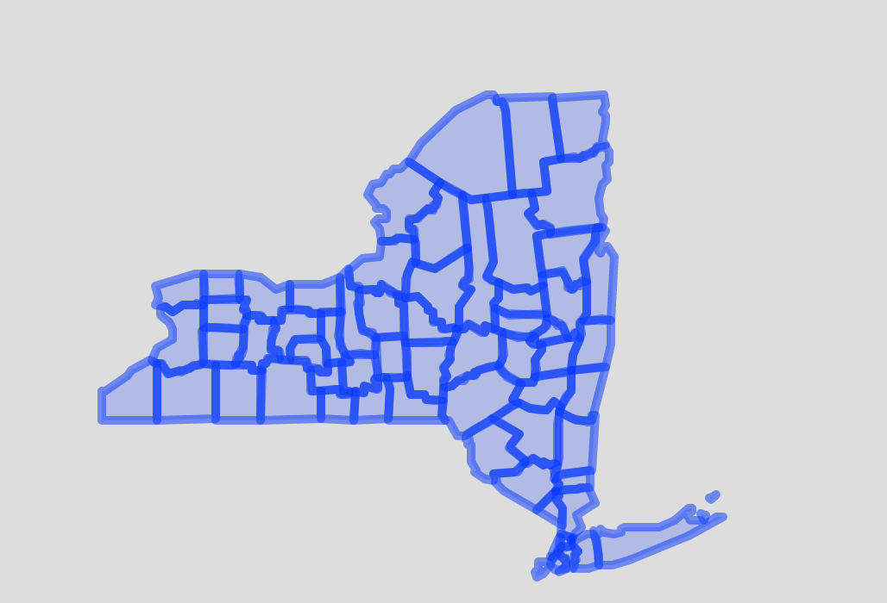
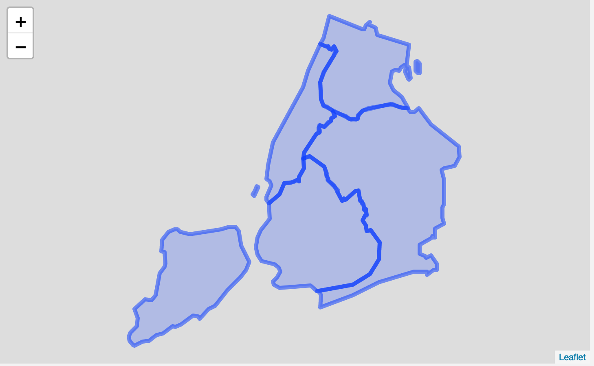
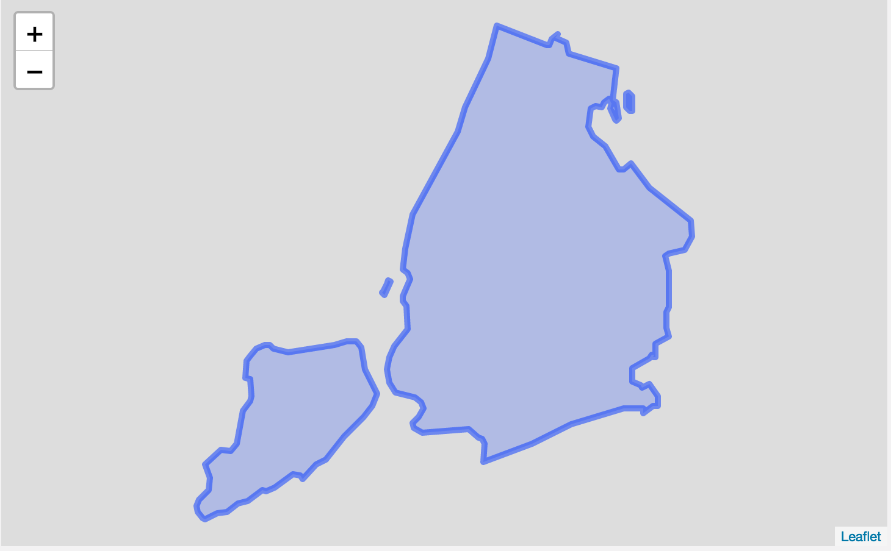
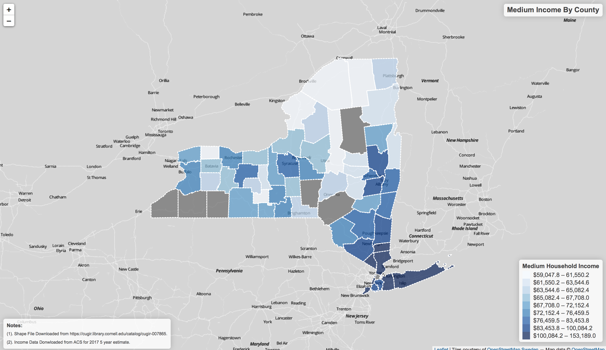

# R_Code_Ref-GEO_PROCESS

Include the most common geo-processing use cases in R. 

- __Data__: 
  - The New York State County Shape File was downloaded [here]( https://cugir.library.cornell.edu/catalog/cugir-007865)
  - 2017 - 5 year estimate for Medium Household Income. Downloaded from American Community Survey (ACS) [here] (https://factfinder.census.gov/faces/nav/jsf/pages/index.xhtml)
- __R libraries__:
  - [sf: geo process tools in R](https://github.com/r-spatial/sf)
  - [tidyverse: data manipulation tools (dplyr)](https://www.tidyverse.org)
  - [leaflet: plot maps in R](https://rstudio.github.io/leaflet/)
  

### Task 1. Custermized a shape file (by dissolving s selected regions into one polygon)

Below is a New York State County Map Downloaded from [here]( https://cugir.library.cornell.edu/catalog/cugir-007865). 

Our Task is to make the New York City part of 5 regions to "dissolve" to become one region called "NYC" :

Before: 
After: 

### Task 2. Create a leaftlet Map

Our Task is to create a map showing the income level by county: 

To view the full interactive map: download the map located in: img/map_v1.html
